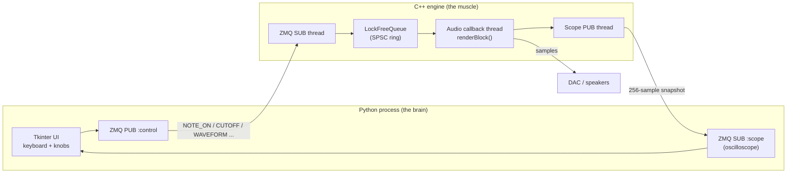
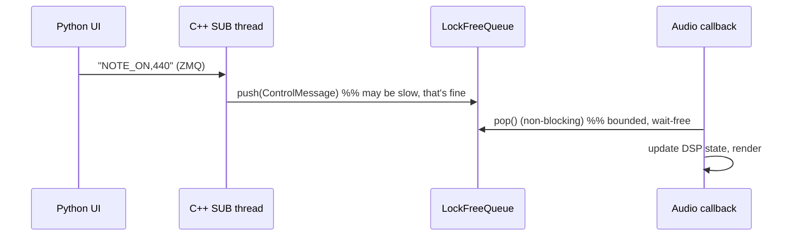
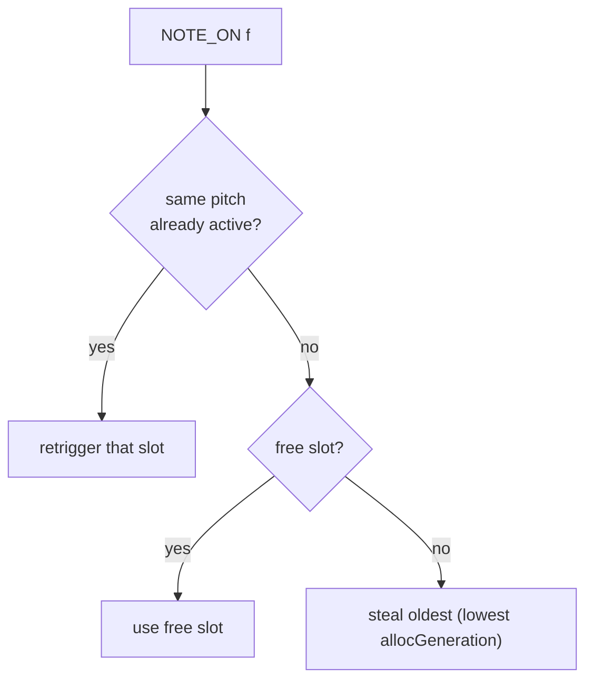
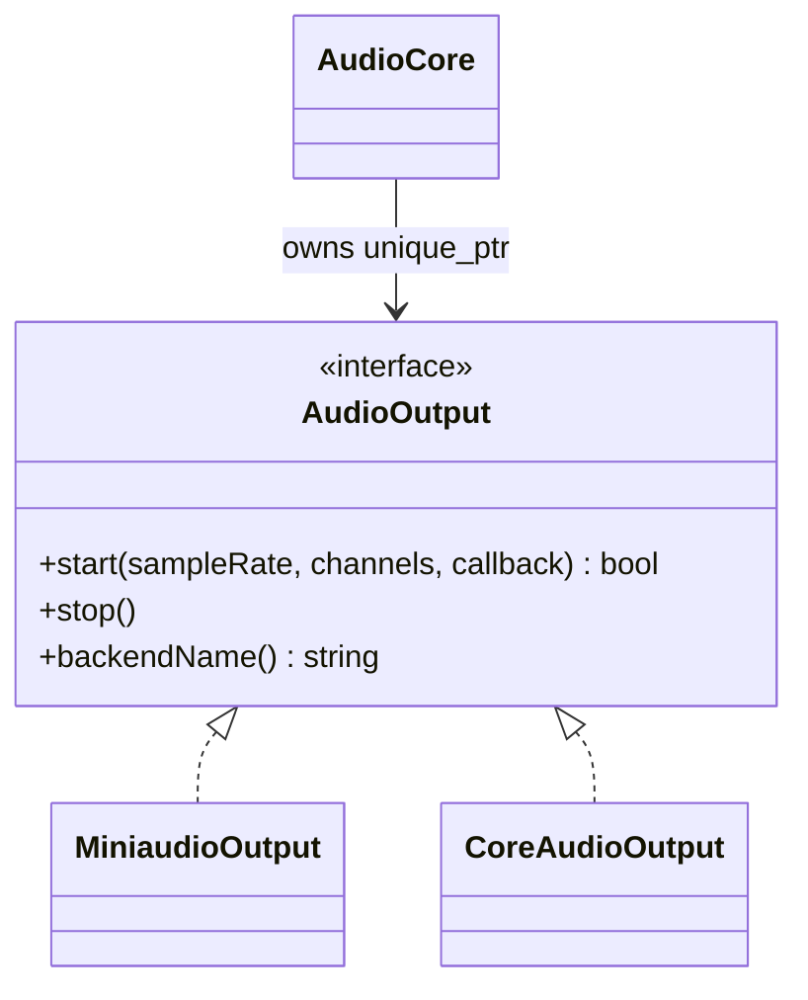

# Interview-Ready Implementation Rundown

Use this as a concise walkthrough of what you built and why the architecture makes sense.

## Project in one sentence

RACE is a real-time C++ synth engine with a Python control UI: controls arrive over ZMQ, are queued lock-free, and are consumed by the audio callback which renders voices and effects with no blocking work on the realtime path.

## End-to-end data flow

1. `py_interface/main.py` UI emits control messages (`NOTE_ON`, `CUTOFF`, `WAVEFORM`, `GAIN`, etc.).
2. `src/main.cpp` runs a ZMQ subscriber thread and pushes parsed `ControlMessage` values into `LockFreeQueue`.
3. `AudioCore::renderBlock()` (called by audio backend callback) drains that queue and updates audio-thread-owned DSP state.
4. Voices render per sample, are mixed polyphonically, then pass through master bus effects and output to DAC.
5. Scope snapshots are published on a second ZMQ PUB endpoint for UI visualization.

## Why this threading model is correct

- Audio callback thread does not lock, allocate, or wait.
- Control-plane work is offloaded to non-audio threads.
- Queue boundary isolates timing jitter from UI/network from realtime audio.
- Voice state is mutated only on the audio thread, avoiding cross-thread races in DSP objects.

## DSP pipeline (current)

Per voice:

`Oscillator (sine/saw/square/triangle) -> SVF filter -> ADSR gain`

Global:

`Poly mix (8 voices, headroom strategy + smoothing) -> master gain -> optional delay wet/dry -> optional soft clip`

### System diagram



The hard boundary is the **lock-free queue**: everything left of it is allowed to
block, allocate, and be slow; everything right of it must never do any of those.

---

# Per-lab growth: what changed, why, and what it taught

Each lab adds one real capability. The point of the table below is the *trajectory*:
a beep becomes a voice, a voice becomes an instrument, an instrument becomes a
real-time system, and a system becomes a portable, measured, optimized product.

| Lab | Capability added | Core C++ / systems concept | DSP concept |
|-----|------------------|----------------------------|-------------|
| 01 | Continuous 440 Hz sine | classes, sample loop | phase accumulator |
| 02 | Note that fades in/out | finite state machine | ADSR envelope (VCA) |
| 03 | Sound actually leaves the speakers | real-time callback, RT constraints | block-based rendering |
| 04 | Python can drive the engine live | threads, IPC, lock-free SPSC queue | control-rate vs audio-rate |
| 05 | Tone can be "darkened" | difference equations in code | Biquad low-pass filter |
| 06 | One filter, many modes | refactor to a reusable primitive | state-variable filter (LP/HP/BP) |
| 07 | Echo + warmth | circular buffers, wet/dry bus | delay line + soft saturation |
| 08 | Play chords | fixed pools, voice stealing | polyphonic mixing + headroom |
| 09 | Pick a tone color | enum-driven strategy | saw/square/triangle waveforms |
| 10 | Make it fast (and prove it) | SIMD (ARM NEON), benchmarking | batch/vectorized oscillator |
| 11 | Make it portable | interface/abstraction, platform code | native Core Audio backend |

## Lab 01 — Phase accumulator (the atom)

**What:** generate a sine without calling `sin()` on a running clock — increment a
phase by `2π·f/fs` each sample and wrap at `2π`.

**Why it matters:** establishes the mental model that *audio is just a number
produced every 1/48000 s*, and that state (phase) must persist across calls with
bit-level precision. Everything else hangs off this loop.

**Learned:** sample rate, Nyquist, why phase (not time) is the right state variable.

## Lab 02 — ADSR envelope (no more clicks)

**What:** an Attack→Decay→Sustain→Release state machine that multiplies the
oscillator (a VCA).

**Why / engineering decision:** a raw note that switches on instantly produces a
**click** (a step discontinuity = broadband energy). The envelope is the first
"don't make it pop" lesson. Later we hardened `noteOn`/`noteOff` to be idempotent so
spamming a key can't reset the level mid-flight.

**Learned:** FSMs in the audio loop, amplitude discontinuities, why shaping = no clicks.

## Lab 03 — Real-time audio callback

**What:** wire the voice into a `miniaudio` callback that the OS calls from a
high-priority thread.

**Why / the central constraint:** the callback has a **hard deadline** — if it
doesn't return a buffer in time you get an XRun (audible gap). This is where the
project's prime directive is born: **on the audio thread, never block, never
`malloc`, never lock.**

**Learned:** real-time vs throughput, the callback contract, RT safety rules.

## Lab 04 — ZMQ + lock-free queue (the system turns "live")

**What:** Python publishes control messages over ZeroMQ; a C++ subscriber thread
parses them and hands them to the audio thread through a **single-producer /
single-consumer lock-free ring buffer**.



**Why / engineering decision:** the UI/network is jittery and allowed to block; the
audio thread is not. A mutex would let the slow side stall the fast side → XRun. The
SPSC queue gives a **wait-free handoff**: the consumer either gets a message or
doesn't, but never waits.

**Learned:** IPC, producer/consumer, `std::atomic`, memory-ordering, why "just add a
lock" is wrong on the audio thread.

## Lab 05 — Biquad low-pass filter

**What:** implement the canonical 2nd-order difference equation and recompute
coefficients whenever Python sends a new cutoff.

**Why:** first taste of subtractive synthesis — sculpting a bright wave by removing
highs. Also the first "coefficients computed on control thread, applied on audio
thread" data-flow.

**Learned:** difference equations → code, filter state (`x[n-1]`, `y[n-1]`), poles/zeros intuition.

## Lab 06 — State-variable filter (one primitive, three modes)

**What:** replace the single-purpose biquad with an SVF that exposes LP/HP/BP from
the same core.

**Why / engineering decision:** chose the SVF because it's **modulation-friendly**
(stable when you sweep cutoff fast) and gives multiple responses from one object —
better API surface for the same cost. A refactor that increases capability without
increasing call-site complexity.

**Learned:** trade-offs between filter topologies, designing a reusable DSP primitive.

## Lab 07 — Delay + soft saturation (the master bus)

**What:** a circular-buffer delay line (feedback echo) and a `tanh` soft clipper,
mixed wet/dry on the master bus.

```text
voice mix ──► [ delay wet/dry ] ──► [ soft clip ] ──► master out
                   │  ▲
                   ▼  │ feedback
                circular buffer
```

**Why / engineering decision:** both default to **bypass** (wet=0, drive=1) and have
explicit early-outs, so users hear pure tones first and we don't burn cycles on
no-op effects. The delay teaches *memory over time*; the clipper teaches *graceful*
vs hard distortion.

**Learned:** circular buffers, feedback stability, wet/dry mixing, why soft (`tanh`)
clipping sounds musical and hard clipping sounds harsh.

## Lab 08 — Polyphony (chords)

**What:** a fixed `std::array<VoiceSlot, 8>`; allocation retriggers the same pitch if
already sounding, else takes a free slot, else **steals the oldest** voice. Release
is pitch-targeted (`NOTE_OFF,<hz>`).



**Why / engineering decisions (and the hard part):**
- Fixed pool, no allocation → RT-safe (no `new` on the audio thread).
- **Headroom:** summing N voices can clip. We scale by an active-voice-aware gain and
  **slew** it (`mixGainCurrent_`) so going 1→2 notes ramps instead of stepping (no pop).
- **Phase decorrelation:** fresh voices get a randomized start phase so stacked notes
  aren't phase-locked (reduces comb-filter buzz).

This lab generated the most iteration (harshness, pops on 1→2, buzzy 3-note chords) —
documented honestly in `POLYPHONY_SOUND_NOTES.md`, where the real fix (band-limited
oscillators) is identified.

**Learned:** voice allocation/stealing, gain staging/headroom, zipper-noise and slew,
why naive waveform stacking aliases.

## Lab 09 — Multi-waveform oscillator

**What:** `Waveform` enum (sine/saw/square/triangle) selected at runtime; UI radio
buttons send `WAVEFORM`.

**Why / engineering decision:** kept the oscillator a thin strategy over a single
`waveformSample(phase, type)` so adding a wave is one switch arm. Deliberately used
**naive** (non-band-limited) saw/square — they're the clearest teaching version and
they motivate Lab-10's performance work and the anti-aliasing discussion.

**Learned:** harmonic content of waveforms, enum-driven dispatch, the aliasing
trade-off (and why "real" synths band-limit).

## Lab 10 — SIMD / ARM NEON (make it fast, then prove it)

**What:** `oscillatorRenderBatch()` renders the oscillator in chunks using NEON
intrinsics (4 lanes), build-gated by `RACE_ENABLE_NEON`. A `benchmark_neon` target
measures scalar vs batch throughput. A UI toggle flips voices between scalar and
batch at runtime.

**Why / engineering decision:** the *real* lesson is **measurement, not magic**. The
honest result on this workload:

| Build | scalar | batch | speedup |
|-------|--------|-------|---------|
| NEON ON | 208 M smp/s | 191 M smp/s | 0.92x |
| NEON OFF | 136 M smp/s | 135 M smp/s | 0.99x |

The NEON-on *build* is ~1.5x faster overall, but the batch path isn't beating scalar
yet because the sine lane still calls scalar `std::sin` and batching overhead
dominates at this size. That's a **genuine, defensible finding** — see
`PERFORMANCE_TRACKING.md` for the path to real gains (vectorized sine approximation,
batching inside the poly loop).

**The phase-wrap bug (good war story):** the first NEON version didn't wrap phase
per-lane into `[0, 2π)`, so lanes near the cycle boundary produced wrong samples
(buzz). Fixed with `wrapPhaseVec` so every lane is wrapped before waveform eval —
a concrete example of *parallelism changing correctness*, not just speed.

**Learned:** SIMD/data-parallelism, intrinsics, benchmarking discipline, runtime
feature toggles, and that "optimized" must be *proven* against a baseline.

## Lab 11 — Core Audio backend + platform abstraction

**What:** introduced an `AudioOutput` interface (`start/stop/backendName`) with two
implementations: `MiniaudioOutput` (portable) and `CoreAudioOutput` (native macOS
AudioUnit). Selectable at build time (`RACE_USE_COREAUDIO`) and at **runtime**
(`RACE_AUDIO_BACKEND=coreaudio|miniaudio`).



**Why / engineering decision:** the DSP core shouldn't know or care how samples reach
the speakers. Hiding the OS behind one interface keeps `AudioCore` portable and makes
the macOS-specific Objective-C++ a leaf module.

**Learned:** dependency inversion, the adapter pattern, Objective-C++ interop, and how
a pro plugin/app structures platform code.

---

## "Does Core Audio actually change much?" — honest answer

**Sound: no. Architecture & story: yes.** This is worth being precise about in an interview.

- **It doesn't change what you hear** because miniaudio *already wraps Core Audio* on
  macOS. So both paths ultimately feed the same `AudioUnit` DefaultOutput. Same
  samples, same DAC → essentially identical audio. That's expected, not a bug.
- **What it does change:**
  - **Removes a dependency layer.** `CoreAudioOutput.mm` talks to `AudioToolbox`
    directly (`AudioComponentFindNext` → `AudioUnitSetProperty` stream format →
    `SetRenderCallback` → `AudioUnitInitialize` → `AudioOutputUnitStart`). You now
    own the exact callback contract instead of inheriting miniaudio's.
  - **Proves the abstraction.** Writing a *second* backend is the real test that
    `AudioOutput` is a good interface — `AudioCore` compiled unchanged against both.
    That's the transferable skill: platform isolation behind an interface.
  - **Unlocks native-only control.** Going direct is the prerequisite for things
    miniaudio hides: explicit device/format negotiation, lower-level latency/buffer
    control, hardware sample-rate handling, and (future) AUv3/Audio Workgroup APIs.
  - **It's the "I can write to the metal" credential.** "I used a cross-platform
    library" and "I implemented the native macOS audio path myself" are very
    different lines on a resume.

**One-liner for interviews:** *"Core Audio doesn't change the sound because miniaudio
sits on top of it anyway — the value was building a backend interface and proving it
by implementing the native path directly, which is the foundation for native-only
latency and device control."*

---

## Realtime correctness talking points (interview)

- Lock-free SPSC handoff between control and audio threads (no mutex on the RT path).
- No dynamic memory, no syscalls, no locks inside the callback.
- Fixed voice pool sized at construction → allocation-free polyphony.
- Deterministic, bounded per-sample work; explicit headroom/limiting in the poly sum.
- Platform backend isolated behind an interface → DSP core stays portable.

## Known quality tradeoffs (honest + strong)

- Naive saw/square are intentionally educational and alias at high pitch; the fix
  (PolyBLEP) and full plan are written up in `POLYPHONY_SOUND_NOTES.md`.
- SIMD path currently demonstrates the infrastructure and measurement methodology;
  net batch speedup needs a vectorized transcendental and in-loop batching.
- Musical polish (anti-aliasing, limiter flavor, voice-steal fades, detune) is
  iterative and expected for synth projects — the roadmap for it is documented.

## How to demo it

```bash
./run.sh                        # builds if needed, opens engine + UI windows
./run.sh --backend coreaudio    # force native macOS path
./run.sh --backend miniaudio    # force portable path (same sound — point made above)
```

---

## Resume-ready summary

```latex
\resumeItemHeading{Real-Time Audio Synthesizer Engine (RACE)}{C++, Python, ZeroMQ}
\resumeItem{Built a real-time software synthesizer with C++ DSP classes implementing
  oscillators (sine/saw/square/triangle via phase accumulation), an ADSR envelope,
  and biquad/state-variable filters to shape each note from scratch.}
\resumeItem{Designed a 3-layer architecture — a Python/Tkinter UI sends note and
  control messages over ZeroMQ to a C++ engine, which renders audio in a real-time
  callback and hands off control data through a lock-free queue between threads.}
\resumeItem{Extended the engine with 8-voice polyphony, a delay/soft-clip effects bus,
  and benchmarking, plus brief explorations of ARM NEON SIMD and a native macOS
  Core Audio backend.}
```

