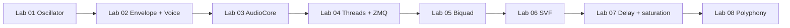

# Roadmap — from Lab 01 to a playable synth

Every lab adds **real code** under `include/` and `src/`. Nothing is throwaway homework — when the curriculum is done, the repo *is* the synth.

**Jump to:** [Curriculum map (DSP + C++)](#curriculum-map-dsp--c-fundamentals) · [Threading arc](#threading-arc) · [Current status](#current-status)

---

## The finished system

```text
┌─────────────────────────────────────────────────────────────────┐
│  py_interface/main.py          (Lab 04)                         │
│  Virtual keyboard, sliders  ──ZMQ──►  control messages          │
└─────────────────────────────────────────────────────────────────┘
                                    │
                    IPC thread (Lab 04) pushes to queue
                                    ▼
┌─────────────────────────────────────────────────────────────────┐
│  src/main.cpp                  main + std::thread (Lab 04)      │
│  include/LockFreeQueue.h       SPSC queue, atomics              │
└─────────────────────────────────────────────────────────────────┘
                                    │
                                    ▼
┌─────────────────────────────────────────────────────────────────┐
│  src/AudioCore.cpp             miniaudio callback (Lab 03)      │
│    drain queue → mix voices → stereo buffer → DAC               │
└─────────────────────────────────────────────────────────────────┘
                                    │
              per-voice chain (Labs 01–02, 05–07):
                                    │
        ┌─────────── Voice ───────────────────────────┐
        │  Oscillator  (Lab 01)                       │
        │       ×  Envelope  (Lab 02)                 │
        │       →  Biquad LPF  (Lab 05)               │
        │       →  SVF / better filter  (Lab 06)      │
        │       →  Delay + saturation  (Lab 07)       │
        └─────────────────────────────────────────────┘
                          × N voices (Lab 08)
```

---

## Curriculum map (DSP + C++ fundamentals)

Each lab teaches specific **DSP** and **C++ / systems** ideas. Keywords are intentional — this is the checklist the project covers.


| Lab      | DSP concepts                                          | C++ / systems concepts                                                                   |
| -------- | ----------------------------------------------------- | ---------------------------------------------------------------------------------------- |
| **01** ✓ | Phase accumulator, sine, sample rate                  | Classes, `const`, unit tests                                                             |
| **02** ✓ | ADSR, FSM, gain multiplication                        | `enum class`, `switch`, state in structs                                                 |
| **03**   | Buffer/block processing, interleaved stereo, DAC path | Callbacks, `static_cast`, RAII, real-time constraints, **implicit 2-thread model**       |
| **04**   | Control-rate vs audio-rate parameters                 | `std::thread`, IPC (ZMQ), **SPSC lock-free queue**, `std::atomic`, memory ordering intro |
| **05**   | Biquad IIR, difference equation, LPF coefficients     | Coefficient recalculation, `constexpr`, avoiding denormals                               |
| **06**   | State-variable filter (SVF), multimode output         | Trapezoidal integration / TPT, smoother modulated cutoff                                 |
| **07**   | Circular delay buffer, soft clip, wet/dry mix         | Ring buffer indexing, nonlinear DSP, effect send/return                                  |
| **08**   | Polyphony, voice stealing, mixing headroom            | Fixed arrays, `std::array`, voice allocation, summing + clamp                            |


**Optional extensions (Labs 09–11):**

| Lab | Topic |
|-----|--------|
| **09** | Saw / square / triangle waveforms |
| **10** | ARM NEON batch oscillator + benchmark |
| **11** | macOS Core Audio HAL backend |

See `learning/lab09/` … `lab11/`. Future: FFT spectrum meter, BLEP anti-aliasing, wavetables.

---

## Threading arc

Multithreading is introduced **gradually** — not all at once.

```text
Lab 03   Main thread + miniaudio audio thread (implicit)
         └── Shared Voice: audio thread only → no sync needed yet

Lab 04   Main spawns ZMQ subscriber thread (explicit std::thread)
         └── Producer (ZMQ thread) → LockFreeQueue → Consumer (audio thread)
         └── Atomics for shutdown flag, maybe parameter snapshots

Lab 08   Same model scales: one control path, one audio path, N voices on audio thread only
```


| Lab   | Threads                | Shared data                    | Sync mechanism                               |
| ----- | ---------------------- | ------------------------------ | -------------------------------------------- |
| 03    | 2 (main + audio)       | `Voice`                        | None — audio-only access                     |
| 04    | 3 (main + audio + ZMQ) | Control messages, frequency    | Lock-free SPSC queue                         |
| 05–07 | 3                      | + filter cutoff, effect params | Queue messages + audio-thread-only DSP state |
| 08    | 3                      | + voice array                  | Voices mutated only in callback              |


**Rule you keep forever:** the audio callback never waits on the UI, never locks, never allocates.

---

## Lab-by-lab: what you build & where it lands


| Lab      | You implement          | New / modified files                     | Lands in final synth as…        |
| -------- | ---------------------- | ---------------------------------------- | ------------------------------- |
| **01** ✓ | Phase accumulator sine | `Oscillator.`*                           | Raw tone generator              |
| **02** ✓ | ADSR + Voice glue      | `Envelope.`*, `Voice.*`                  | Per-note DSP kernel             |
| **03**   | miniaudio callback     | `AudioCore.`*, `main.cpp`                | Real-time buffer loop → DAC     |
| **04**   | ZMQ + lock-free queue  | `LockFreeQueue.h`, ZMQ thread, Python UI | Live keyboard / knobs           |
| **05**   | Biquad low-pass        | `Biquad.`* → `Voice`                     | Basic subtractive filter        |
| **06**   | State-variable filter  | `StateVariableFilter.`* → `Voice`        | Smoother sweeps, HP/BP/LP modes |
| **07**   | Delay + soft clip      | `DelayLine.`*, `SoftClip.*`, effect bus  | Echo + warmth on output         |
| **08**   | Polyphony + mixing     | `Voice[]` in `AudioCore`                 | Chords, voice stealing          |


---

## Dependency graph




---

## What “done” looks like after each lab

### Lab 01 — Oscillator ✓

- `./build/test_lab01` all `ok`
- Numerical sine, one sample at a time

### Lab 02 — Envelope + Voice ✓

- `./build/test_lab02` all `ok`
- `Voice::nextSample()` = osc × envelope

### Lab 03 — First beep ← **you are here**

- `./build/test_lab03` all `ok`
- `./build/race_synth` → 440 Hz from speakers with soft attack
- Understand: main thread vs audio thread, `renderBlock` as permanent inner loop

### Lab 04 — Python + concurrency

- `./build/race_synth` + `python py_interface/main.py`
- Press key → pitch changes
- Can explain: why lock-free queue, who produces/consumes, why not `mutex` in callback

### Lab 05 — Biquad

- Cutoff slider dulls brightness
- Signal chain: `Biquad(Envelope(Oscillator))`

### Lab 06 — Better filter

- SVF mode switch (LP / HP / BP)
- Smoother cutoff sweeps without zipper noise (coeff smoothing optional stretch)

### Lab 07 — Effects

- Delay time + feedback slider
- Soft saturation on master or per-voice
- Wet/dry mix

### Lab 08 — Polyphony

- Play chords from keyboard
- Max voices (e.g. 8), steal oldest on overflow
- Mix with headroom clamp

---

## Testing strategy


| Phase      | Verify with                                                  |
| ---------- | ------------------------------------------------------------ |
| Labs 01–02 | `test_lab01`, `test_lab02` — pure math                       |
| Lab 03+    | Unit tests for `renderBlock` / DSP + **listen** for glitches |
| Lab 04+    | Integration: Python + C++ running together                   |


```bash
cmake --build build
./build/test_lab01
./build/test_lab02
./build/test_lab03
# future: test_lab04 … test_lab08
```

---

## Files that grow over time

```text
include/DSP_utilities/
  Oscillator.h           Lab 01 ✓
  Envelope.h             Lab 02 ✓
  Voice.h                Lab 02 ✓ — extended Labs 05–07
  Biquad.h               Lab 05
  StateVariableFilter.h  Lab 06
  DelayLine.h            Lab 07
  SoftClip.h             Lab 07

include/
  AudioCore.h            Lab 03
  LockFreeQueue.h        Lab 04

src/ …                   matching .cpp files
py_interface/main.py     Lab 04
tests-and-benchmarks/    test_lab01 … test_lab08
```

---

## Current status

- [x] Lab 01 — Oscillator
- [x] Lab 02 — Envelope + Voice
- [x] Lab 03 — AudioCore + miniaudio
- [x] Lab 04 — `std::thread` + ZMQ + lock-free queue
- [x] Lab 05 — Biquad LPF
- [x] Lab 06 — State-variable filter
- [x] Lab 07 — Delay + soft saturation
- [x] Lab 08 — Polyphony
- [ ] **Lab 09 — Waveforms** ← you are here
- [ ] Labs 10–11 — NEON, Core Audio *(extensions)*

**Next step:** [lab09/README.md](lab09/README.md)
**Extensions:** [lab09](lab09/README.md) · [lab10](lab10/README.md) · [lab11](lab11/README.md)